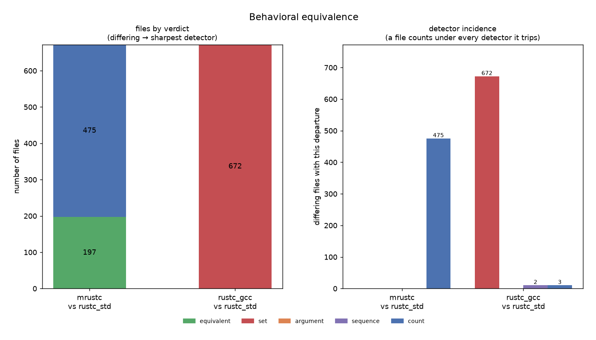
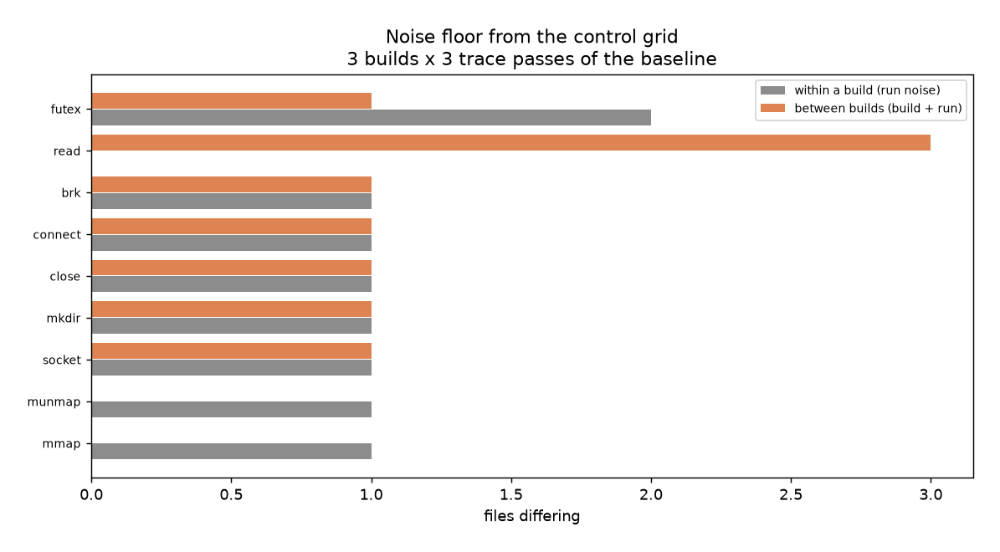
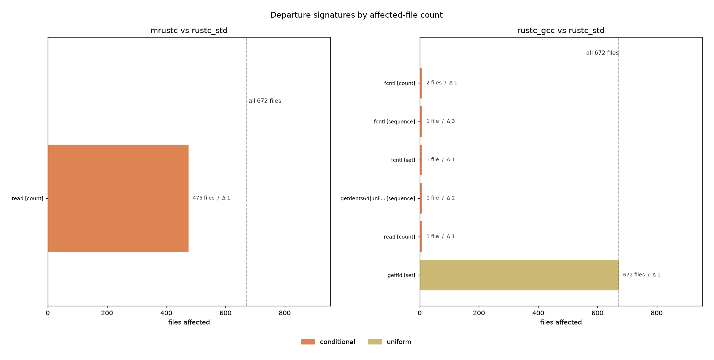
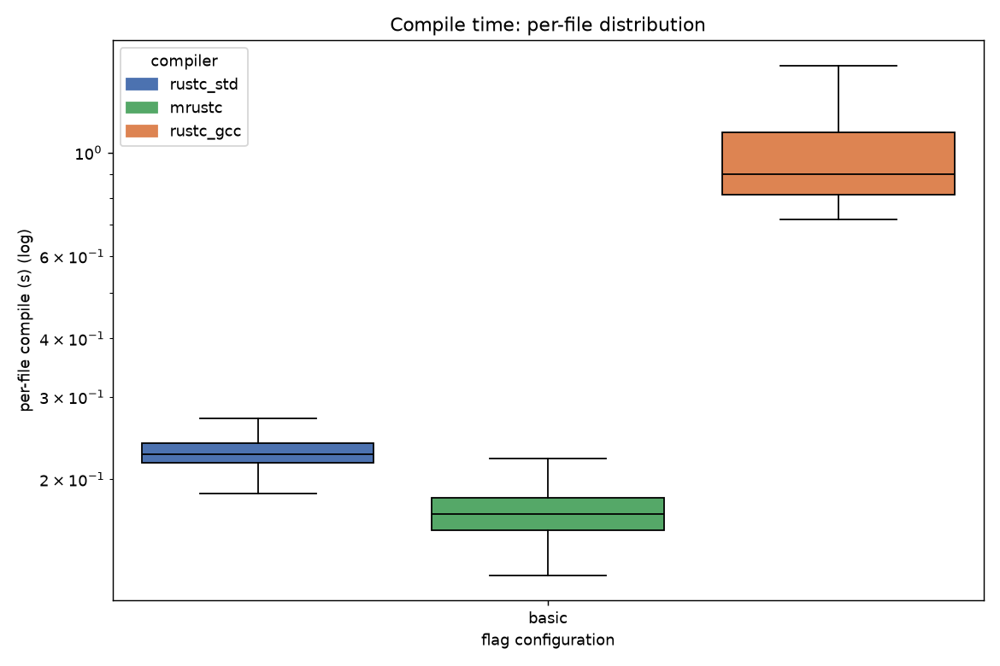
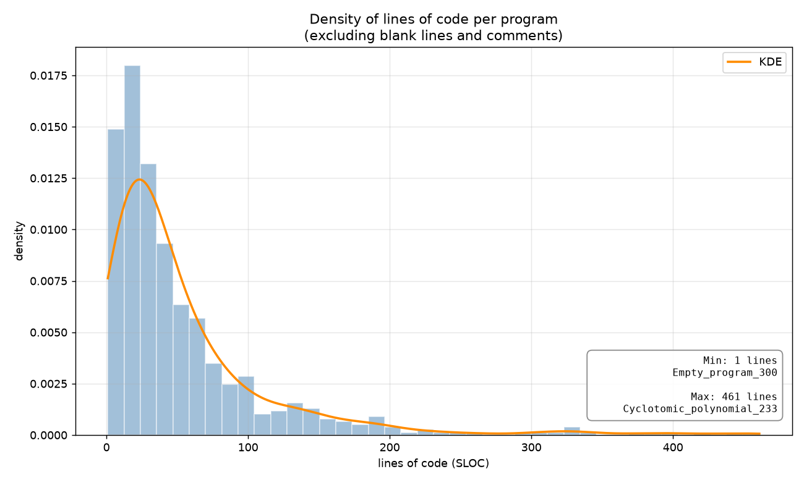

# compilerdiv

Open-source behavioral equivalence analysis package of diverse compilers.

`compilerdiv` compares the binaries emitted by the reference compiler against those
emitted by diverse variants, across a corpus of self-contained programs, and
reports whether their runtime behavior is distinguishable. The corpus language
and the compilers under test are declared in the config. Nothing in the tool is
tied to a particular language or toolchain.

It exists because Diverse Double Compilation needs bit-for-bit comparison, which may not be the case 
for behaviorally equivalent compilers. `compilerdiv` represents a behavioral
comparison instead of the bit-exact one. This package can also be used as stack-trace benchmarking across different compilers.

> Every figure below comes from the reference study shipped in `compilerdiv.yaml`:
> 672 self-contained Rust programs (on **`src/codebase/`**) compiled by stock `rustc` (**`rustc_std`**, the
> baseline), an `mrustc`-bootstrapped `rustc` (**`mrustc`**), and
> `rustc_codegen_gcc` (**`rustc_gcc`**). Regenerate them with `compilerdiv analyze`.

---

## Quickstart

```bash
pip install -e ".[fast]"        # 'fast' adds pyarrow, strongly recommended
# If you are willing to contribute:
# pip install -e ".[fast,dev]"

cp compilerdiv.yaml myconfig.yaml   # edit paths and compiler commands
```

You can run it with `compilerdiv`:

```
compilerdiv -c myconfig.yaml preflight   # check strace and the compilers first
compilerdiv -c myconfig.yaml acquire     # the sweep (hours, resumable)
compilerdiv -c myconfig.yaml analyze     # reports + figures (seconds, re-runnable)
```

Or via the Makefile:

```bash
make preflight
make acquire            # make acquire 
make analyze
make run                # both
```

Interrupted sweeps resume automatically, just run `acquire` again.

---

## What it measures

Four detectors, each answering a different question, each with its own
empirically derived noise floor:

| detector | question | example it catches |
|---|---|---|
| **set** | does B make a syscall A never makes? | A has no `write`, B has `write` |
| **count** | does B make N more of some syscall? | `read(+1)` |
| **argument** | does B pass a value A never passes? | `openat("/etc/passwd")` vs `openat("/lib/x.so")` at identical counts |
| **sequence** | does B order calls in a way A never does? | same calls, reordered |

A departure is only reported when it is **stable**: present in every trace rep
of B and absent in every rep of A. Facts that flicker between reps are noise by
construction and are dropped before any comparison.



This is the alternative for the bit-for-bit comparison DDC would make, and the
left panel is the resolution of that substitute: 197 of 672 programs are
behaviorally indistinguishable from the baseline under `mrustc`, none under
`rustc_gcc`. The right panel shows *which* detector fired: `rustc_gcc` trips
**set** on the whole corpus (it makes a syscall the baseline never makes), while
`mrustc` trips only the weakest detector, **count**. Bit-for-bit, all 672 would
have differed under both.

---

## The control passes

The baseline is measured as a **nested grid** of `controls.builds`
compilations x `controls.passes` trace sessions. Group (0,0) is `A`, the rest
are tagged `A@<build>.<pass>`.

| comparison | binary | what it isolates |
|---|---|---|
| between **passes** of one build (`A` vs `A@0.1`) | identical | run-to-run noise (ASLR, scheduler, futex, DNS) |
| between **builds** (`A` vs `A@1.0`) | different | that, plus build nondeterminism (link layout, embedded paths) |

Because the passes are nested inside the builds, both classes are *measured*
rather than inferred by subtraction. Together they license a claim like:

> `read` is stable across passes of every build (not run noise), stable across
> builds (not build noise), and differs A-vs-B. Therefore it is a genuine,
> reproducible property of B's toolchain.

Neither pass alone supports that sentence.

The floor those passes produce is published, not assumed:



Read it as *the baseline disagreeing with itself*.

---

## The departure taxonomy

Deciding whether a difference is *benign* is not statically decidable. `compilerdiv` **partitions** departures into classes with different
priors, attaches the evidence, and hands you the `taxonomy` sheet of
`behavior.xlsx`.

| class | criterion | prior                                  |
|---|---|----------------------------------------|
| `run_noise` | differs between passes of one build | not a compiler difference at all       |
| `build_noise` | stable within a build, differs between builds | baseline's own builds vary this way    |
| `uniform` | identical delta in ≥95% of the corpus | program-independent/toolchain startup |
| `conditional` | fixed delta in a *subset* | **check the layout probe**             |
| `program_dependent` | delta scales with program size | **Needs further investigation**        |

A **layout probe** correlates membership in the affected set
against binary size, segment count, and section count. The probe reports *why* it could not compute a correlation when it can't
(`no ELF data`, `every file affected`, `no usable layout variable`).

The **departure matrix** is the review map: every distinct signature
(`syscall [detector]`), how many files it touches, and the class it landed in.



---

## Benchmarking across compilers

The same sweep that feeds the equivalence verdict also records size, compile
time, and exec time per file, so the tool doubles as a cross-compiler benchmark
harness. Every measurement is per-file and distributional: `benchmark.xlsx`
carries the geomeans and fold-changes, but the distribution is what tells you
whether a geomean means anything:



The same triple of figures (absolute, fold-change,
distribution) exists for `size` and `exec`.

### The corpus

Benchmark numbers are only as meaningful as the programs behind them, so the
corpus reports on itself (`compilerdiv corpus`):



---

## Outputs

```
results/
├── raw/                       # append-only store, the acquire/analyze contract
│   ├── manifest.json          # settings fingerprint
│   ├── counts/  sequence/  args/  bench/  elf/  errors/
├── behavior.xlsx              # everything behavioral, one readme glosses every column
│     readme  per_file  departures  taxonomy  per_syscall_stats  noise_floor
├── benchmark.xlsx             # geomeans, fold-change vs baseline
└── figures/
    ├── equivalence/           # headline: equivalent vs differing, by detector
    ├── taxonomy/              # departures by class (empty red column = the claim)
    ├── departure_matrix/      # signature × affected files, the review map
    ├── layout_probe/          # conditional departures vs binary size
    ├── noise_floor/           # what the controls found
    ├── top_divergent/  total_syscalls/  volcano/  effect_sizes/
    ├── js_divergence/         # descriptive only (see caveat)
    ├── benchmark/             # size, compile, exec: absolute + fold-change + distribution
    └── corpus/sloc_density.png
```

---

## Documentation

- **[docs/USAGE.md](docs/USAGE.md)**: commands, configuration reference,
  resume semantics, troubleshooting
- **[docs/ARCHITECTURE.md](docs/ARCHITECTURE.md)**: module map, data flow,
  extension points
- **[docs/INTERPRETING.md](docs/INTERPRETING.md)**: how to read the outputs and
  turn them into paper claims

---

## Requirements

- Python ≥ 3.10
- `strace` (and permission to use it, see `preflight`)
- `readelf` (optional, enables the layout probe)
- The compilers under test

On servers where ptrace is confined, set `trace.wrapper: ["unshare", "-Ur"]`
(the default). Set it to `[]` if your machine allows plain strace.

## Testing

```bash
make install-dev
make test
make test-cov
```

## Acknowledgements

This work was conducted by João Gouvea-Versiani during a Mitacs Globalink Research Internship at Université de Montréal, Montréal, Canada, under the supervision of Prof. Benoit Baudry.

## License

MIT.
